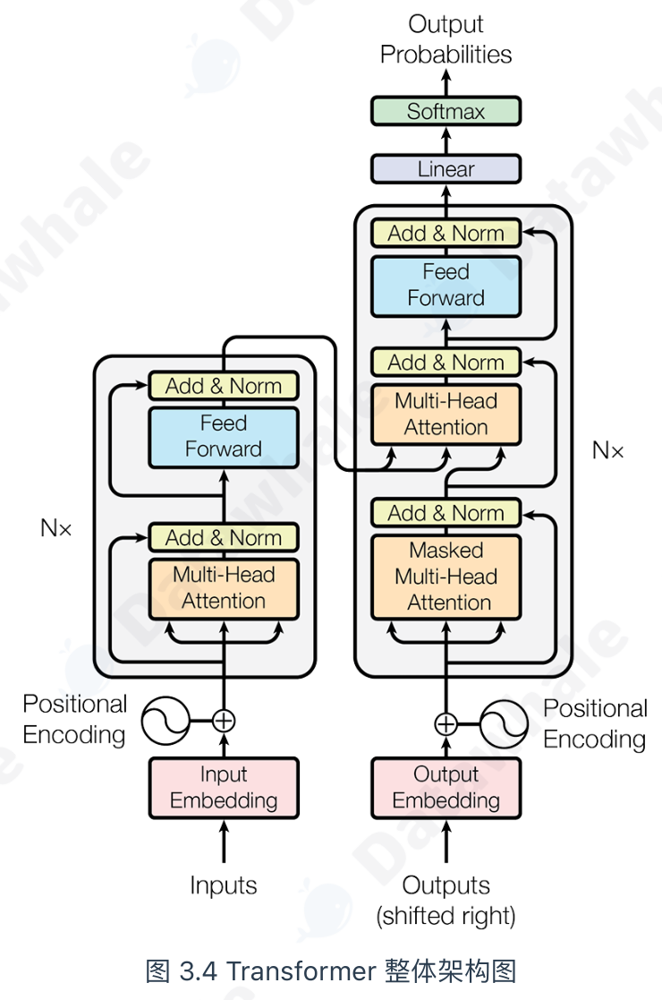
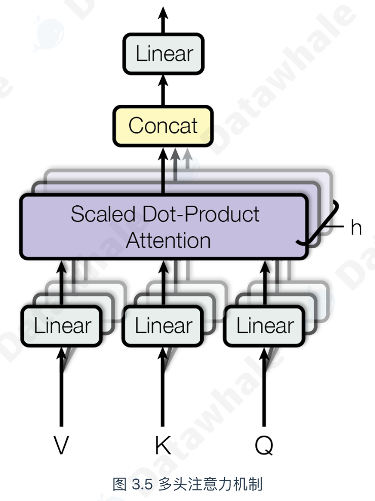
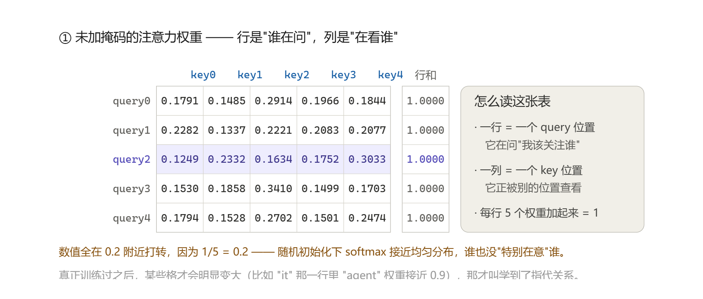

# `transformer.py` + `main.py` 代码讲解 —— Transformer 架构解析

> 本文讲解《Hello Agents》**3.1.2 节 Transformer 架构解析**的全部代码，共两个文件：
> `transformer.py`（模型定义，375 行）与 `main.py`（演示程序，262 行）。
>
> 教材为了控制篇幅，采用的是"**自顶向下**"的写法：先给出 Encoder / Decoder 的骨架，
> 再把 `MultiHeadAttention`、`PositionWiseFeedForward`、`PositionalEncoding` 三个模块
> 像拼图一样逐一填进去，最后停在"不再继续往下深入实现"。
> 本项目的做法是：**忠实还原教材给出的每一行代码**，同时补上教材省略的
> **N 层堆叠、掩码生成、Transformer 主类**，让整套代码能够真正跑起来、逐步验证。
>
> 建议对照阅读顺序：先看图 3.4 建立整体印象 → 按 §2~§7 逐模块看实现 → §8 看补全部分 → 跑 `main.py` 看数字。

---

## 一、先看全局：Transformer 长什么样



教材图 3.4 的读法可以概括为一行：

```
左侧 Encoder（理解）          右侧 Decoder（生成）
─────────────────────        ─────────────────────
Input Embedding + 位置编码     Output Embedding + 位置编码
        ↓                              ↓
  ┌───────────┐  × N           ┌───────────────────┐  × N
  │ 多头自注意力 │               │ 掩码多头自注意力 (对自己) │
  │ Add & Norm │               │ Add & Norm        │
  │ 前馈网络    │               │ 交叉注意力 (对编码器输出) │
  │ Add & Norm │               │ Add & Norm        │
  └───────────┘               │ 前馈网络            │
        └──────── 编码器输出 ───▶│ Add & Norm        │
                              └───────────────────┘
                                       ↓
                                  Linear → Softmax → 输出概率
```

一句话分工：**编码器负责"理解"整句输入，解码器一边看自己已生成的前文、一边"咨询"编码器的理解结果，逐个吐出目标词。**

解码器比编码器多出来的那个子层叫**交叉注意力**（Cross-Attention），它的 Q 来自解码器自己，K / V 来自编码器输出——这就是"咨询"发生的地方。代码里体现为 `DecoderLayer` 里多了一个 `self.cross_attn`。

### 文件结构与职责

```
第三章/Transformer/
├── transformer.py     # 模型定义：位置编码 / 多头注意力 / 前馈网络 / Encoder-Decoder / 掩码
├── main.py            # 演示程序：形状追踪 / 因果掩码 / 位置编码 / 完整前向传播
├── requirements.txt   # 依赖：torch
├── 代码讲解.md         # 📄 本文档
└── assets/            # 教材图 3.4 / 图 3.5
```

`transformer.py` 内部的分段**与教材小节编号一一对应**，这是刻意的设计，方便对照：

| 文件中的位置 | 对应教材小节 |
|---|---|
| `EncoderLayer` / `DecoderLayer` | （1）Encoder-Decoder 整体结构 |
| `MultiHeadAttention` | （2）从自注意力到多头注意力 |
| `PositionWiseFeedForward` | （3）前馈神经网络 |
| （内联在 Layer 里） | （4）残差连接与层归一化 |
| `PositionalEncoding` | 3.1.2.5 位置编码 |
| `Encoder` / `Decoder` / `Transformer` / 掩码函数 | 教材未给出，本项目补全 |

---

## 二、教材的"自顶向下"骨架（以及它埋着的一个坑）

教材 3.1.2 节开篇先甩出这份骨架，注意看 `EncoderLayer.__init__` 里的两行：

```python
import torch
import torch.nn as nn
import math

# --- 占位符模块，将在后续小节中实现 ---
class PositionalEncoding(nn.Module):
    """位置编码模块"""
    def forward(self, x):
        pass

class MultiHeadAttention(nn.Module):
    """多头注意力机制模块"""
    def forward(self, query, key, value, mask):
        pass

class PositionWiseFeedForward(nn.Module):
    """位置前馈网络模块"""
    def forward(self, x):
        pass

# --- 编码器核心层 ---
class EncoderLayer(nn.Module):
    def __init__(self, d_model, num_heads, d_ff, dropout):
        super(EncoderLayer, self).__init__()
        self.self_attn = MultiHeadAttention()        # 待实现
        self.feed_forward = PositionWiseFeedForward() # 待实现
        self.norm1 = nn.LayerNorm(d_model)
        self.norm2 = nn.LayerNorm(d_model)
        self.dropout = nn.Dropout(dropout)

    def forward(self, x, mask):
        # 残差连接与层归一化将在 3.1.2.4 节中详细解释
        # 1. 多头自注意力
        attn_output = self.self_attn(x, x, x, mask)
        x = self.norm1(x + self.dropout(attn_output))
        # 2. 前馈网络
        ff_output = self.feed_forward(x)
        x = self.norm2(x + self.dropout(ff_output))
        return x
```

这个骨架的好处是**思路清晰**：先声明"我要用这些零件"，再逐个实现。但如果你**原样照抄**教材的骨架再去接后面的模块实现，程序会立刻崩：

> ⚠️ **教材骨架埋了一个坑：`MultiHeadAttention()` 和 `PositionWiseFeedForward()` 是无参调用的。**
>
> 而教材后面给出的真实实现，`__init__` 是需要参数的：
> `MultiHeadAttention(d_model, num_heads)`、`PositionWiseFeedForward(d_model, d_ff, dropout)`。
> 于是"骨架 + 实现"拼在一起就会报
> `TypeError: __init__() missing 2 required positional arguments`（或者占位类被换成真实类后，`self.d_k` 根本不存在，`forward` 时抛 `AttributeError`）。
>
> **修复方法**：在 Layer 的 `__init__` 里把参数透传下去——
> ```python
> self.self_attn   = MultiHeadAttention(d_model, num_heads)
> self.feed_forward = PositionWiseFeedForward(d_model, d_ff, dropout)
> ```
> 本项目的 `transformer.py` 已经这样修正。这也是为什么"看骨架要理解意图，拼代码要动手跑一遍"。

另外还有两处**前后不一致**，读教材时值得留意：

1. 占位符里写的是 `forward(self, query, key, value, mask)`，而最终实现写的是 `forward(self, Q, K, V, mask=None)`——**形参名变了**。只要调用方是位置传参（`self.self_attn(x, x, x, mask)`）就没问题；如果有人用关键字传参 `query=...` 就会报错。
2. `DecoderLayer.__init__` 里创建了 `MultiHeadAttention()` 和 `cross_attn`，但教材骨架**没有给 `Enc`/`Dec` 的堆叠类，也没有给 `Transformer` 主类**。所以教材的"完整代码"其实跑不出一个完整模型——需要补（见 §8）。

---

## 三、（1）Encoder-Decoder 整体结构

### `EncoderLayer`：编码器的一层

```python
class EncoderLayer(nn.Module):
    def __init__(self, d_model, num_heads, d_ff, dropout):
        super(EncoderLayer, self).__init__()
        self.self_attn = MultiHeadAttention(d_model, num_heads)
        self.feed_forward = PositionWiseFeedForward(d_model, d_ff, dropout)
        self.norm1 = nn.LayerNorm(d_model)
        self.norm2 = nn.LayerNorm(d_model)
        self.dropout = nn.Dropout(dropout)

    def forward(self, x, mask):
        attn_output = self.self_attn(x, x, x, mask)          # ① 多头自注意力
        x = self.norm1(x + self.dropout(attn_output))        # ② Add & Norm
        ff_output = self.feed_forward(x)                     # ③ 前馈网络
        x = self.norm2(x + self.dropout(ff_output))          # ④ Add & Norm
        return x
```

逐行说明：

| 行 | 做了什么 |
|---|---|
| `self.self_attn = MultiHeadAttention(d_model, num_heads)` | 一个自注意力子层。**"自"** 体现在 `forward` 里 Q、K、V 传的都是同一个 `x` |
| `self.norm1 / self.norm2` | 两个独立的 `LayerNorm`。注意是**两个不同的实例**，不能共用一个，否则参数被绑定 |
| `self.dropout` | 一个 Dropout 实例被两处复用，因为 Dropout 本身没有可学习参数，复用无害 |
| `self.self_attn(x, x, x, mask)` | Q=K=V=x，所以叫"自"注意力。`mask` 用来屏蔽 padding（源端） |
| `x = self.norm1(x + self.dropout(attn_output))` | **这行就是 Add & Norm**：`x + ...` 是残差连接（Add），`self.norm1(...)` 是层归一化（Norm） |
| 最后 `return x` | 输出形状与输入形状**完全相同** `(batch, seq_len, d_model)` |

> 💡 **为什么"输出形状 = 输入形状"这件事极其重要？**
> 正因为每一层的输入输出形状一致，才能把 N 个一模一样的层"串珠子"一样堆起来（图 3.4 里的 `N×`）。
> 这也是 Transformer 能堆到几十上百层的前提。这个性质在注意力、前馈网络里被反复维护，是本架构的设计核心。

### `DecoderLayer`：解码器的一层

```python
class DecoderLayer(nn.Module):
    def __init__(self, d_model, num_heads, d_ff, dropout):
        super(DecoderLayer, self).__init__()
        self.self_attn = MultiHeadAttention(d_model, num_heads)
        self.cross_attn = MultiHeadAttention(d_model, num_heads)    # ← 编码器层没有的
        self.feed_forward = PositionWiseFeedForward(d_model, d_ff, dropout)
        self.norm1 = nn.LayerNorm(d_model)
        self.norm2 = nn.LayerNorm(d_model)
        self.norm3 = nn.LayerNorm(d_model)                          # ← 三个 norm
        self.dropout = nn.Dropout(dropout)

    def forward(self, x, encoder_output, src_mask, tgt_mask):
        # 1. 掩码多头自注意力（对自己）
        attn_output = self.self_attn(x, x, x, tgt_mask)
        x = self.norm1(x + self.dropout(attn_output))
        # 2. 交叉注意力（对编码器输出）
        cross_attn_output = self.cross_attn(x, encoder_output, encoder_output, src_mask)
        x = self.norm2(x + self.dropout(cross_attn_output))
        # 3. 前馈网络
        ff_output = self.feed_forward(x)
        x = self.norm3(x + self.dropout(ff_output))
        return x
```

与编码器层的差异一共三处，全都源于"解码器要多看一份资料"：

1. **多一个 `cross_attn` 子层**，因此也多一个 `norm3`；
2. **两个掩码**：`tgt_mask` 给自注意力（挡住目标序列里"未来的词"），`src_mask` 给交叉注意力（挡住源序列里的 padding）；
3. 交叉注意力的 **Q 用解码器的 `x`，K 和 V 用编码器的 `encoder_output`**：

```python
cross_attn_output = self.cross_attn(x, encoder_output, encoder_output, src_mask)
#                                            ↑Q        ↑K          ↑V
```

> 💡 **K 和 V 为什么传同一个 `encoder_output`？**
> 这是"开卷考试"类比里最关键的一点：编码器输出既充当"资料索引"（K，告诉你哪儿有信息），又充当"资料内容"（V，真正的信息）。Q 是解码器当前想问的问题。
> 形状上：Q 是 `(batch, tgt_len, d_model)`，K/V 是 `(batch, src_len, d_model)`——**Q 和 K 的序列长度可以不同**，这正是机器翻译"源句 7 个词 → 目标句 6 个词"能成立的原因。注意力机制天生支持这种"不等长"的查询。

---

## 四、（2）从自注意力到多头注意力 ⭐ 全书最核心的一段

### 4.1 直觉：读一句话时你在做什么

考虑句子 *"The agent learns because **it** is intelligent."* 读到加粗的 **it** 时，你的大脑会自动把注意力更多地放在前面的 **agent** 上，才能判断 it 指代谁。

**自注意力（Self-Attention）就是把这个过程数学化**：处理序列中每个词时，让它"看"句中所有词，并给每个词分配一个**注意力权重**。权重越高 = 关联越强 = 它的信息在当前位置的表示里占比越大。

为此给每个词元向量引入三个角色：

| 角色 | 代号 | 含义 | 类比 |
|---|---|---|---|
| 查询 | Q（Query） | 当前词在"查询"别人 | 你手里的**问题** |
| 键 | K（Key） | 每个词可被查询的"标签" | 资料册的**目录/索引** |
| 值 | V（Value） | 每个词本身携带的"内容" | 资料册的**正文** |

三个向量都由**同一个词嵌入向量**乘上三个不同的、**可学习的**权重矩阵得到：

```
Q = X · W_Q      K = X · W_K      V = X · W_V
```

四步计算流程（教材的"**开卷考试**"类比）：

```
① 准备"考题"和"资料"：每个词用 W_Q / W_K / W_V 生成自己的 Q、K、V
② 计算相关性得分   ：用词的 Q 去点乘句中所有词的 K  → 得分 = Q·Kᵀ
③ 稳定化与归一化   ：除以 √d_k 防止梯度过小 → Softmax 变成总和为 1 的权重
④ 加权求和         ：用权重分别乘各词的 V，再相加 → 融合全局上下文的新表示
```

合成一个公式：

```
Attention(Q, K, V) = softmax( Q·Kᵀ / √d_k ) · V
```

### 4.2 为什么需要"多头"

只做一次注意力，模型可能**只学会关注一种关系**（比如只学会看主语）。但语言关系是复合的：指代、时态、从属……所以"多头"的思想很朴素——**把一次做完，改成分成几组、分开做、再合并**。



把 Q、K、V 在 **d_model 维度** 上切成 h 份（h = 头数），每份独立做一次单头注意力，相当于让 h 个专家从不同子空间审视同一句话；最后把 h 个结果拼接、再过一个线性层整合输出。图 3.5 的 `Concat → Linear` 就是这个动作。

> 💡 **"切维度"而不是"切序列"**——这是最容易理解错的一点。
> 多头切的是**特征维度**（`d_model = 512` → 8 个头，每头 `d_k = 64`），每个头看到的仍然是**完整序列的所有词**，只是每个词只拿了 1/8 的特征。不是把句子切成 8 段分给 8 个头。

### 4.3 代码逐行

```python
class MultiHeadAttention(nn.Module):
    def __init__(self, d_model, num_heads):
        super(MultiHeadAttention, self).__init__()
        assert d_model % num_heads == 0, "d_model 必须能被 num_heads 整除"
        self.d_model = d_model
        self.num_heads = num_heads
        self.d_k = d_model // num_heads          # 每个头的维度
        # 定义 Q, K, V 和输出的线性变换层
        self.W_q = nn.Linear(d_model, d_model)
        self.W_k = nn.Linear(d_model, d_model)
        self.W_v = nn.Linear(d_model, d_model)
        self.W_o = nn.Linear(d_model, d_model)
```

- `assert d_model % num_heads == 0`：因为后面 `x.view(...)` 要把 d_model 均分成 h 份，不能整除就直接炸。**断言让错误"早暴露"，比在 view 里报一句含糊的 shape 错误好得多**——这是个值得学的工程习惯。
- **四个 `nn.Linear(d_model, d_model)`**：`W_q`、`W_k`、`W_v` 是教材提的 Q/K/V 投影矩阵，`W_o` 是图 3.5 顶端那个 `Linear`（多头合并后的输出投影）。注意每个都是 `d_model → d_model`，形状不变，**变的是"含义"**（投影到不同的子空间）。
- **参数量**：每个 Linear 约 `d_model²`，四个共约 `4·d_model²`。d_model=512 时约 105 万参数。

```python
    def scaled_dot_product_attention(self, Q, K, V, mask=None):
        # 1. 计算注意力得分 (QK^T)
        attn_scores = torch.matmul(Q, K.transpose(-2, -1)) / math.sqrt(self.d_k)
        # 2. 应用掩码 (如果提供)
        if mask is not None:
            attn_scores = attn_scores.masked_fill(mask == 0, -1e9)
        # 3. 计算注意力权重 (Softmax)
        attn_probs = torch.softmax(attn_scores, dim=-1)
        # 4. 加权求和 (权重 * V)
        output = torch.matmul(attn_probs, V)
        return output
```

| 行 | 关键点 |
|---|---|
| `K.transpose(-2, -1)` | 只交换**最后两维**（`(..., seq_k, d_k)` → `(..., d_k, seq_k)`），前面的 batch 和 head 维原样保留。用 `-2/-1` 而不是写死的 `1/2`，是为了兼容"带 head 维"和"不带 head 维"两种输入 |
| `matmul` 得到 `(..., seq_q, seq_k)` | 矩阵 `[q, k]` 的每个格 = 第 q 个词 query 与第 k 个词 key 的点积 = **相关性得分** |
| `/ math.sqrt(self.d_k)` | **缩放**。d_k 越大点积结果的方差越大，Softmax 会变得极端（趋近 one-hot），梯度趋近 0。除以 √d_k 把方差拉回 1 左右 |
| `masked_fill(mask == 0, -1e9)` | 把"不可见"的位置填成一个很大的负数。Softmax 后 `e^(-1e9) ≈ 0`，等价于概率 0 |
| `torch.softmax(..., dim=-1)` | 在**最后一维（被关注的序列维度）**归一化，所以每一行的和恒等于 1。**注意不是 `dim=1`**——在多头张量里 dim=1 是 head 维，写错就全乱了 |
| `matmul(attn_probs, V)` | `(..., seq_q, seq_k) × (..., seq_k, d_k)` → `(..., seq_q, d_k)`。Shape 上中间那个 `seq_k` 被"消掉"，物理含义就是"按权重把各个 V 加权求和" |

```python
    def split_heads(self, x):
        # (batch_size, seq_length, d_model) → (batch_size, num_heads, seq_length, d_k)
        batch_size, seq_length, d_model = x.size()
        return x.view(batch_size, seq_length, self.num_heads, self.d_k).transpose(1, 2)

    def combine_heads(self, x):
        # (batch_size, num_heads, seq_length, d_k) → (batch_size, seq_length, d_model)
        batch_size, num_heads, seq_length, d_k = x.size()
        return x.transpose(1, 2).contiguous().view(batch_size, seq_length, self.d_model)
```

这两个函数是"分身术"和"合体术"，值得画图理解：

```
split_heads:
  (batch, seq, d_model)  例如 (2, 5, 8)
        │ view(batch, seq, num_heads, d_k)     把最后 8 维看成 2×4
        ▼
  (batch, seq, num_heads, d_k)                 (2, 5, 2, 4)
        │ transpose(1, 2)                     把 heads 提到 seq 前面
        ▼
  (batch, num_heads, seq, d_k)                  (2, 2, 5, 4)  ← 后两维可以直接做批量 matmul

combine_heads: 上面的逆过程
  (batch, num_heads, seq, d_k) ─transpose(1,2)→ (batch, seq, num_heads, d_k) ─view→ (batch, seq, d_model)
```

两个高频坑：

1. **`transpose(1, 2)` 之后必须 `.contiguous()` 才能 `.view()`**。`transpose` 只改"步长（stride）"，不搬动内存，得到的是**不连续**的视图；而 `.view()` 要求内存连续。`.contiguous()` 会真正复制一份连续内存，把行/列顺序"落实"下来。少了它就会报
   `RuntimeError: view size is not compatible with input tensor's size and stride`。
   （替代写法是 `.reshape()`，它会自动判断要不要复制，更省心。）
2. **两个函数里的 `view(...)` 顺序不能写反**：split 是 `seq` 在前、`num_heads` 在后；combine 是 `num_heads` 在前、`seq` 在后。因为 split 时切成 `[seq, heads, d_k]`，transpose 后内存里顺序就是 `[heads, seq, d_k]`。

```python
    def forward(self, Q, K, V, mask=None):
        # 1. 对 Q, K, V 进行线性变换，并把 head 维切出来
        Q = self.split_heads(self.W_q(Q))
        K = self.split_heads(self.W_k(K))
        V = self.split_heads(self.W_v(V))
        # 2. 计算缩放点积注意力（h 个"小注意力"并行）
        attn_output = self.scaled_dot_product_attention(Q, K, V, mask)
        # 3. 合并多头输出并进行最终的线性变换
        output = self.W_o(self.combine_heads(attn_output))
        return output
```

注意 `W_q`、`split_heads` 的顺序：**先 Linear 再切分**，等价于"为每个头各配一个 `d_model → d_k` 的小 Linear"，但用一次大矩阵乘法**一次性算完**，这就是工程上的向量化。

### 4.4 张量形状速查（以 batch=2, seq=5, d_model=8, heads=2 为例）

| 步骤 | 形状 | 说明 |
|---|---|---|
| 输入 `x` | `(2, 5, 8)` | batch, seq_len, d_model |
| `W_q(x)` | `(2, 5, 8)` | 线性层不改变形状 |
| `split_heads` | `(2, 2, 5, 4)` | 多了 head 维，d_k = 8/2 = 4 |
| `Q @ Kᵀ` | `(2, 2, 5, 5)` | 每个头一张 5×5 的相关性分数表 |
| `softmax` | `(2, 2, 5, 5)` | 每行（对全句的注意力分布）和为 1 |
| `@ V` | `(2, 2, 5, 4)` | 中间维 5 被消掉 |
| `combine_heads` | `(2, 5, 8)` | 8 = 2 头 × 4 维 |
| `W_o(...)` | `(2, 5, 8)` | 输出与输入同形 ✅ |

**记住这条：`(B, S, D)` 进去，永远 `(B, S, D)` 出来。** 前面 §3 说的"形状不变"性质，在这里又一次被维持。

---

## 五、（3）前馈神经网络（FFN）

注意力层负责**从整个序列动态聚合信息**，FFN 则负责**从这些聚合后的信息里提取更高阶的特征**。

关键词是"**逐位置**（Position-wise）"：它**独立地作用于序列中的每一个词元向量**，长度 `seq_len` 的序列会被实际调用 `seq_len` 次。但所有位置**共享同一组权重**——既保持了独立加工能力，又大幅减少参数量。

```python
class PositionWiseFeedForward(nn.Module):
    def __init__(self, d_model, d_ff, dropout=0.1):
        super(PositionWiseFeedForward, self).__init__()
        self.linear1 = nn.Linear(d_model, d_ff)
        self.dropout = nn.Dropout(dropout)
        self.linear2 = nn.Linear(d_ff, d_model)
        self.relu = nn.ReLU()

    def forward(self, x):
        # x 形状: (batch_size, seq_len, d_model)
        x = self.linear1(x)      # 升维 → (batch_size, seq_len, d_ff)
        x = self.relu(x)         # 非线性激活
        x = self.dropout(x)
        x = self.linear2(x)      # 降回 → (batch_size, seq_len, d_model)
        return x
```

公式：

```
FFN(x) = max(0, x·W₁ + b₁)·W₂ + b₂
```

| 关键点 | 说明 |
|---|---|
| **先扩大再缩小** | 通常 `d_ff = 4 × d_model`（512 → 2048）。中间宽、两头窄，被认为能学到更丰富的特征表示 |
| **为什么要有 ReLU** | 没有激活函数的话，`Linear` 叠 `Linear` 等价于**一个** Linear，深度就白加了。ReLU 提供了非线性 |
| **为什么线性层能对 `(B, S, D)` 直接作用 3D 张量** | `nn.Linear` 只对**最后一维**做变换，前面的 batch / seq 维被当成"批量"处理。所以这一句代码就自动实现了"逐位置" |
| **参数量** | `d_model·d_ff + d_ff·d_model`，512/2048 时约 210 万，**比注意力层（约 105 万）还大**——FFN 往往是 Transformer 里参数最多的地方 |

---

## 六、（4）残差连接与层归一化（Add & Norm）

教材正文解释了这两个操作，但**没有单独写成类**，因为它被内联在 Layer 里了。回头看这行代码：

```python
x = self.norm1(x + self.dropout(attn_output))
#   └─Norm─┘ └───────Add（残差连接）───────┘
```

| 操作 | 代码 | 作用 |
|---|---|---|
| **残差连接（Add）** | `x + self.dropout(attn_output)` | 把子模块的输入 `x` 直接加到子模块的输出上。反向传播时梯度可以**绕过子模块直接向前传**，解决深层网络的梯度消失问题。公式：`Output = x + Sublayer(x)` |
| **层归一化（Norm）** | `self.norm1(...)` | 对**单个样本的所有特征**做归一化（均值 0、方差 1），让每层输入分布保持稳定，缓解**内部协变量偏移**，加速收敛、提升稳定性 |

两个容易搞混的细节：

1. **`LayerNorm` 和 `BatchNorm` 不是一回事**。BatchNorm 在 **batch 维**上统计，RNN/变长序列里 batch 内样本长度不一，统计会失真；LayerNorm 在**单个样本的特征维**上统计，与 batch 大小、序列长度都无关，所以在 NLP 里几乎一律用 LayerNorm。
2. **`self.dropout` 放在残差相加之前**（`x + dropout(sub(x))`），而不是之后。这是"Pre-LN vs Post-LN"之外的另一个小选择；本实现与教材一致——**先 Dropout 再相加，最后 Norm**（即 Post-LN 风格）。原论文也是这个顺序。

> 💡 顺带说：`x + ...` 要求 `x` 和子模块输出形状完全一致——这又是 §3 里"形状不变"性质在起作用。**整篇代码有一条暗线：所有模块都在小心翼翼地维持 `(B, S, D)` 不变，为的就是让残差加法永远成立。**

---

## 七、（5）位置编码 PositionalEncoding

### 7.1 为什么需要它

自注意力**完全不包含任何顺序信息**：对注意力来说，"agent learns" 和 "learns agent" 是**完全等价**的，因为它只看词与词的关系，不看排列。

解决办法：给每个词嵌入向量**额外加上**一个能代表其位置的"位置向量"。关键在于——**这个位置向量不是学出来的，而是用固定公式直接算出来的**。

于是即使两个词元（比如两个都叫 `agent` 的词）自身的嵌入相同，也会因为**位置不同**、加上了**不同的位置编码**，而变得独一无二。

### 7.2 公式

```
PE(pos, 2i)   = sin( pos / 10000^(2i/d_model) )
PE(pos, 2i+1) = cos( pos / 10000^(2i/d_model) )
```

- `pos`：词元在序列中的位置（0, 1, 2, …）
- `i`：位置向量里的维度索引（0 到 d_model/2 − 1）
- `d_model`：词嵌入维度
- **偶数维用 sin，奇数维用 cos**

### 7.3 代码逐行

```python
class PositionalEncoding(nn.Module):
    def __init__(self, d_model: int, dropout: float = 0.1, max_len: int = 5000):
        super().__init__()
        self.dropout = nn.Dropout(p=dropout)
        # 创建一个足够长的位置编码矩阵
        position = torch.arange(max_len).unsqueeze(1)                       # (max_len, 1)
        div_term = torch.exp(torch.arange(0, d_model, 2) * (-math.log(10000.0) / d_model))
        pe = torch.zeros(max_len, d_model)
        # 偶数维度使用 sin, 奇数维度使用 cos
        pe[:, 0::2] = torch.sin(position * div_term)
        pe[:, 1::2] = torch.cos(position * div_term)
        # 注册为 buffer：不算模型参数，但会随 to(device) 一起移动
        self.register_buffer('pe', pe.unsqueeze(0))                          # (1, max_len, d_model)

    def forward(self, x: torch.Tensor) -> torch.Tensor:
        x = x + self.pe[:, :x.size(1)]     # 只取前 seq_len 个位置，广播相加
        return self.dropout(x)
```

几个精妙之处：

| 代码 | 为什么这么写 |
|---|---|
| `torch.arange(max_len).unsqueeze(1)` | 把 `(max_len,)` 变成 `(max_len, 1)`，好与 `div_term` 做**广播**乘法，得到 `(max_len, d_model/2)` 的 `pos × 频率` 表 |
| `torch.exp(arange * (-log(10000)/d_model))` | **数学技巧**：`10000^(-2i/d_model) = exp(-(2i/d_model)·ln10000)`。用 `exp` 而不是直接写 `10000 ** (...)`，是因为**指数运算数值更稳定、也更快**。教材把它一步算完，避免了逐维开方 |
| `pe[:, 0::2] = sin(...)` | `0::2` 是 Python 切片"从 0 开始隔一个取一个"= **偶数维**；`1::2` = **奇数维**。一行就把 sin/cos 交错铺满 |
| `register_buffer('pe', ...)` | **关键工程细节**：`pe` 是常量，**不该被优化器更新**，所以不能是 `nn.Parameter`；但它又需要跟随模型 `.to(device)` / `.float()`。`register_buffer` 正好同时满足这两点。如果直接存成 `self.pe = pe`（普通属性），一旦模型搬到 GPU 就会报设备不一致 |
| `pe.unsqueeze(0)` | 在前面加一个 batch 维，变成 `(1, max_len, d_model)`，这样才能和 `x` 的 `(batch, seq_len, d_model)` 广播相加 |
| `self.pe[:, :x.size(1)]` | **按需截取**：预生成了 max_len=5000 个位置，但实际序列可能只有 12 个词，只取前 12 行，多出来的不参与计算 |
| 最后 `return self.dropout(x)` | 加上位置编码后再 Dropout。**注意**：位置编码被加在**输入**上（图 3.4 里那个 ⊕ 号），而不是每一层都加 |

### 7.4 用 sin/cos 的额外好处

- **无参数、可外推**：公式与词表无关、与数据无关，训练时最长见过 5000 个位置，理论上还能算更长；
- **相对位置可表示**：`PE(pos+k)` 可以由 `PE(pos)` 通过一个**线性变换**得到（正弦余弦的和角公式），这让模型容易学到"相隔 k 个词"这类相对关系；
- **不同位置互相区分**：每个位置得到一个独一无二的"坐标指纹"。

---

## 八、补全部分：让模型真正跑起来

教材到位置编码就收尾了（"不再继续往下深入实现"）。但要跑通一次完整的前向传播，还缺三块。下面逐一补上。

### 8.1 掩码：注意力的"两把钥匙"

```python
def make_padding_mask(seq, pad_idx=0):
    """
    填充掩码：把 <pad> 占位符挡住。
    seq 形状 (batch, seq_len) → 返回 (batch, 1, 1, seq_len) 布尔张量，True = 保留
    """
    return (seq != pad_idx).unsqueeze(1).unsqueeze(2)


def make_causal_mask(seq_len, device=None):
    """
    因果掩码（下三角）：第 t 个位置只能看到 ≤ t 的位置，不能"偷看"未来。
    返回 (1, 1, seq_len, seq_len) 布尔张量，下三角（含对角线）为 True
    """
    mask = torch.tril(torch.ones(seq_len, seq_len, dtype=torch.bool, device=device))
    return mask.unsqueeze(0).unsqueeze(0)
```

为什么要补这两个？因为教材的 `masked_fill(mask == 0, -1e9)` 要求 `mask` 能**广播**成 `(batch, num_heads, seq_q, seq_k)`。中间那两个 `1` 维就是为广播准备的：

```
真正的形状            广播目标
(batch, 1, 1, seq_len)  →  (batch, num_heads, seq_q, seq_k)   # padding_mask
(1, 1, seq_len, seq_len) →  (batch, num_heads, seq_q, seq_k)   # causal_mask
```

两个掩码叠加用**逻辑与**：

```python
tgt_mask = make_padding_mask(tgt) & make_causal_mask(tgt_len)
```

含义是"**既不是 padding，又不在当前位置之后**"的位置才允许被关注。

> ⚠️ **mask 的语义约定要小心**：本实现里 **`True` = 保留、`False` = 屏蔽**，所以判据是 `masked_fill(mask == 0, ...)`。如果你自己的 mask 用 `1 = 屏蔽`，条件就得改成 `mask == 1`。**这两个约定极易搞反，且搞反了不会报错、只会让模型悄悄学不到东西**——调参时最怕这种静默错误。另外，遮罩后一定要检查 Softmax 那一行**没有全被遮掉**，否则整行都是 `-1e9`，Softmax 会输出 NaN。

### 8.2 `Encoder` / `Decoder` 堆叠

```python
class Encoder(nn.Module):
    def __init__(self, num_layers, d_model, num_heads, d_ff, dropout):
        super().__init__()
        self.layers = nn.ModuleList(
            [EncoderLayer(d_model, num_heads, d_ff, dropout) for _ in range(num_layers)]
        )
        self.norm = nn.LayerNorm(d_model)

    def forward(self, x, mask):
        for layer in self.layers:
            x = layer(x, mask)
        return self.norm(x)
```

三个要点：

1. **必须用 `nn.ModuleList` 而不是普通 Python `list`**。如果把层放进普通 list，PyTorch 的 `nn.Module` **不会**递归注册子模块，后果是：这些层的参数**不会出现在 `model.parameters()` 里**，优化器看不到它们，**训练时它们永远不更新**——而且不报错。这是 PyTorch 最经典的"静默 Bug"之一。
2. `for layer in self.layers: x = layer(x, mask)`：**形状不变**性质在这里兑现——同一个 `x` 在循环里被反复"洗"，这就是图 3.4 的 `N×`。
3. 收尾加一个 `LayerNorm`（原论文/post-LN 常见做法），把最后一层的输出再次标准化。

`Decoder` 同理，只是每个层多传两个参数：

```python
    def forward(self, x, encoder_output, src_mask, tgt_mask):
        for layer in self.layers:
            x = layer(x, encoder_output, src_mask, tgt_mask)
        return self.norm(x)
```

### 8.3 `Transformer` 主类 —— 把拼图拼完

```python
class Transformer(nn.Module):
    def __init__(self, src_vocab_size, tgt_vocab_size, d_model=512, num_heads=8,
                 num_layers=6, d_ff=2048, dropout=0.1, max_len=5000):
        super().__init__()
        assert d_model % num_heads == 0, "d_model 必须能被 num_heads 整除"
        self.d_model = d_model
        self.src_embedding = nn.Embedding(src_vocab_size, d_model)
        self.tgt_embedding = nn.Embedding(tgt_vocab_size, d_model)
        self.positional_encoding = PositionalEncoding(d_model, dropout, max_len)
        self.encoder = Encoder(num_layers, d_model, num_heads, d_ff, dropout)
        self.decoder = Decoder(num_layers, d_model, num_heads, d_ff, dropout)
        self.fc_out = nn.Linear(d_model, tgt_vocab_size)

    def forward(self, src, tgt, src_mask=None, tgt_mask=None):
        encoder_output = self.encode(src, src_mask)
        decoder_output = self.decode(tgt, encoder_output, src_mask, tgt_mask)
        return self.fc_out(decoder_output)
```

对照图 3.4 从下往上读：

| 图 3.4 中的方块 | 代码 |
|---|---|
| Input Embedding | `self.src_embedding` |
| Output Embedding | `self.tgt_embedding` |
| Positional Encoding（⊕） | `self.positional_encoding` |
| 左侧 `N×` 大框 | `self.encoder` |
| 右侧 `N×` 大框 | `self.decoder` |
| 顶端 Linear | `self.fc_out` |
| 顶端 Softmax | 训练时包含在 `CrossEntropyLoss` 里，推理时自己调 |

`encode` / `decode` 里各有一句容易被忽略的关键代码：

```python
src = self.src_embedding(src) * math.sqrt(self.d_model)   # × √d_model
```

**为什么要乘 √d_model？** 词嵌入初始化时数值较小（约 N(0,1) 再缩放），而位置编码的 sin/cos 在 [-1, 1] 之间。如果直接把两者相加，位置信息会"淹没"词义信息。乘上 √d_model 把嵌入的量级抬到与位置编码可比，两者才能势均力敌。这是原论文的做法，教材为了简洁省掉了，本实现补上并注释说明。

最后 `fc_out` 把 `d_model` 维的隐藏状态映射成**目标词表大小的打分（logits）**——这就是"下一个词"背后的原始分数。

---

## 九、跑起来：`main.py` 的四个演示分别在验证什么

`main.py` 不训练、不下载数据、不需要 GPU，几秒钟跑完。四个演示层层递进：

| 演示 | 验证什么 | 期望看到 |
|---|---|---|
| **1. 张量形状追踪** | `(2,5,8)` 怎么变成 `(2,2,5,4)` 再变回 `(2,5,8)` | `d_k = 8/2 = 4`；输出与输入同形 |
| **2. 因果掩码实验** | Softmax 前后加上 `-1e9` 的效果 | 加掩码后**右上三角全是 0.0000**，每行仍和为 1 |
| **3. 位置编码实验** | 同词不同位 → 向量不同 | 位置编码的**可学习参数为 0**；两个相同词元加编码后平均绝对差 > 0 |
| **4. 完整前向传播** | 端到端形状与参数量 | `logits: (batch, tgt_len, tgt_vocab)`，并给出贪心解码结果 |

运行：

```bash
cd 第三章/Transformer
pip install -r requirements.txt
python main.py
```

演示 2 的核心输出长这样（`torch.manual_seed(42)`，可复现）：

> ❗ **先搞清楚这些数字"是谁的权重"**：演示 2 的输入是 `x = torch.randn(1, 5, 8)`，
> 也就是 **5 个随机向量**，它们**不对应任何一句话、也没有任何语义**。
> 所以这两张 5×5 表是"随机向量之间互相算出来的注意力分布"，**不是对某句话的理解结果**。
>
> 读法：**行 = query（谁在问"我该关注谁"），列 = key（谁在被看）**，每行 5 个权重加起来恰好是 1。
> 因为权重矩阵是随机初始化的、模型也没训练过，数值会挤在 `1/5 = 0.2` 附近——
> **这是"接近均匀分布"的特征，说明此刻谁也没特别在意谁**。
> 真正训练过的模型里，某些格子才会明显变大（例如 "it" 那一行里 "agent" 的权重接近 0.9）。
>
> 所以这个演示要看的是 **掩码带来的结构变化**（右上三角必须变成 0），而不是数值大小。
> 顺带一提：在真实模型里，这样一张矩阵是"**某一层、某一个头**"的注意力；
> 演示里 `num_heads=1`，所以只有一张；若 `num_heads=8`，就会有 8 张叠加。

把上面这段话浓缩成一张图，就是下面这张**注意力权重矩阵读法图**（以演示 2 打印的 ① 未加掩码矩阵为例）：



图中几个要点值得记牢：

- **一行 = 一个 query 位置**，它在问"我该关注谁"；
- **一列 = 一个 key 位置**，它正被别的位置查看；
- **每行 5 个权重加起来 = 1**（Softmax 归一化的结果，也是校验实现是否写对的快捷办法）；
- 数值全在 `0.2` 附近打转，是因为 `1/5 = 0.2`——随机初始化下 Softmax 接近**均匀分布**，谁也没"特别在意"谁。真正训练过之后，某些格子才会明显变大（如 "it" 那一行里 "agent" 的权重接近 0.9），那才叫学到了指代关系。

```text
① 未加掩码的注意力权重（softmax 之后）   形状 = (5, 5)
        pos0    pos1    pos2    pos3    pos4
  pos0  0.1791  0.1485  0.2914  0.1966  0.1844
  pos1  0.2282  0.1337  0.2221  0.2083  0.2077
  pos2  0.1249  0.2332  0.1634  0.1752  0.3033
  pos3  0.1530  0.1858  0.3410  0.1499  0.1703
  pos4  0.1794  0.1528  0.2702  0.1501  0.2474

② 加因果掩码后的注意力权重   形状 = (5, 5)
        pos0    pos1    pos2    pos3    pos4
  pos0  1.0000  0.0000  0.0000  0.0000  0.0000
  pos1  0.6305  0.3695  0.0000  0.0000  0.0000
  pos2  0.2394  0.4472  0.3134  0.0000  0.0000
  pos3  0.1844  0.2239  0.4110  0.1807  0.0000
  pos4  0.1794  0.1528  0.2702  0.1501  0.2474
```

**右上三角恒为 0**，第 `r` 行只有前 `r+1` 个位置有权重——第 0 行"只能看自己"，第 4 行可以看到全部 5 个位置。还可以顺便验证一件事：**② 的最后一行和 ① 的最后一行完全相同**（`0.1794 0.1528 0.2702 0.1501 0.2474`），因为第 4 行本来就"没有未来可遮"。这说明掩码只改变它该改变的地方，没有引入多余扰动。这就是 Masked Self-Attention，也正是 §3.1.3 讲的 Decoder-Only 架构赖以工作的机制。

演示 3 里还藏着一个很漂亮的结论。把位置编码两两做余弦相似度，会得到：

```text
位置编码的余弦相似度矩阵   形状 = (6, 6)
        pos0    pos1    pos2    pos3    pos4    pos5
  pos0  1.000   0.884   0.641   0.491   0.567   0.790
  pos1  0.884   1.000   0.884   0.641   0.491   0.567
  pos2  0.641   0.884   1.000   0.884   0.641   0.491
  pos3  0.491   0.641   0.884   1.000   0.884   0.641
  pos4  0.567   0.491   0.641   0.884   1.000   0.884
  pos5  0.790   0.567   0.491   0.641   0.884   1.000

  相邻位置（隔 1 位）的相似度：[0.884, 0.884, 0.884, 0.884, 0.884]
```

**"隔 1 位"的相似度恒为 0.884，与起点无关**（`sim[0,1] = sim[1,2] = sim[2,3] = 0.884`），说明位置编码携带的是**相对距离**信息，而不是单纯的绝对坐标。这就是 §7.4 说的"相对位置可表示"在数值上的直接证据——也是后面各种"相对位置编码"改进方案的出发点。

---

## 十、易踩的坑 & 常见疑问

**Q1：为什么 `softmax` 是 `dim=-1`，不是 `dim=1`？**
`dim=-1` 是**被关注的序列维（seq_k）**。写 `dim=1` 在多头张量里归一化的是 **head 维**，得到的东西没有任何物理意义，而且不报错。判断标准：**Softmax 要作用在"分数的行"上，让每一行的和等于 1**。

**Q2：`view` 和 `reshape` 有什么区别？**
`view` 要求内存连续，不连续会报错；`reshape` 在必要时自动复制。`combine_heads` 里 `transpose` 之后必须 `.contiguous().view(...)`，或者直接 `.reshape(...)`。教学场景建议先用 `reshape` 少踩坑，等理解了 stride 再切回 `view`。

**Q3：`-1e9` 为什么不用 `-inf`？**
数学上 `-inf` 更"正确"，但 `-inf` 参与运算可能产生 `inf - inf = NaN`。用一个足够大的负数 `-1e9` 更稳。不过要留神：**如果某一行全被遮掉，`-1e9` 也会让 Softmax 变成 NaN**，所以因果掩码必须保证"至少有对角线"。

**Q4：`LayerNorm` 放在残差前还是后？**
本实现（和教材一致）是 **Post-LN**：`norm(x + sub(x))`。现代大模型更常用 **Pre-LN**：`x + sub(norm(x))`，训练更稳定、不太依赖 warmup。教材用的是 Post-LN，读的时候知道有这两种即可。

**Q5：代码里 `d_model=512, num_heads=8` 是怎么定的？**
教材/原论文的默认超参。约束只有一条：**`d_model` 必须能整除 `num_heads`**（否则 `view` 切不开）。`d_ff = 4 × d_model` 也是经验惯例。

**Q6：为什么参数量算下来 FFN 比注意力还大？**
注意力约 `4·d_model²`（d_model=512 → 105 万），FFN 约 `2·d_model·d_ff = 8·d_model²`（→ 210 万）。所以**FFN 往往是 Transformer 参数量最大的模块**，这也是后来 MoE 改造 FFN 的动机。

---

## 十一、一句话总结

这份代码回答了一个问题：**"注意力"到底是怎么用矩阵乘法做出来的？**

答案可以压缩成一句话——
**把每个词嵌入分别投影成 Q / K / V 三份，用 `softmax(QKᵀ/√d_k)` 算出"谁该看谁"的权重表，再按这张表把 V 加权求和；重复 h 次、拼起来，就是多头注意力。**

其余的部件都在服务两条暗线：

1. **形状守恒**：`(B, S, D)` 进、`(B, S, D)` 出，残差加法才能成立、模型才能堆 N 层；
2. **信息边界**：位置编码补上"顺序"，padding 掩码挡住"填充"，因果掩码挡住"未来"——每一处约束都在回答"这个词**应该**看到什么"。

教材用"自顶向下"教会我们结构，而把骨架"拼成能跑的代码"的过程，恰好暴露了教材为了篇幅省略的三块拼图（**参数透传、N 层堆叠、掩码**）。这三块补上，图 3.4 才真正活过来。

---

### 附：本文件对照表

| `transformer.py` 中的类/函数 | 教材是否给出 | 教材小节 |
|---|:---:|---|
| `EncoderLayer` / `DecoderLayer` | ✅ | （1）Encoder-Decoder 整体结构 |
| `MultiHeadAttention` | ✅ | （2）从自注意力到多头注意力 |
| `PositionWiseFeedForward` | ✅ | （3）前馈神经网络 |
| Add & Norm（内联在 Layer 中） | ✅ | （4）残差连接与层归一化 |
| `PositionalEncoding` | ✅ | 3.1.2.5 位置编码 |
| `Encoder` / `Decoder` 堆叠 | ➕ 本项目补全 | —— |
| `make_padding_mask` / `make_causal_mask` | ➕ 本项目补全 | 概念见 3.1.3 |
| `Transformer` 主类 | ➕ 本项目补全 | —— |
| `transformer.py` 底部自检 / `main.py` 四个演示 | ➕ 本项目新增 | —— |
