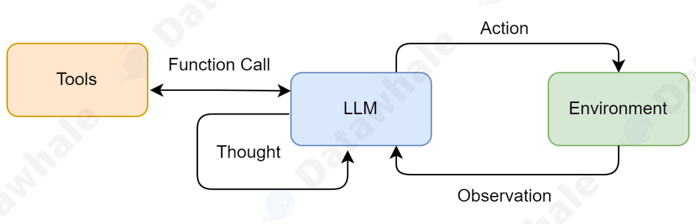
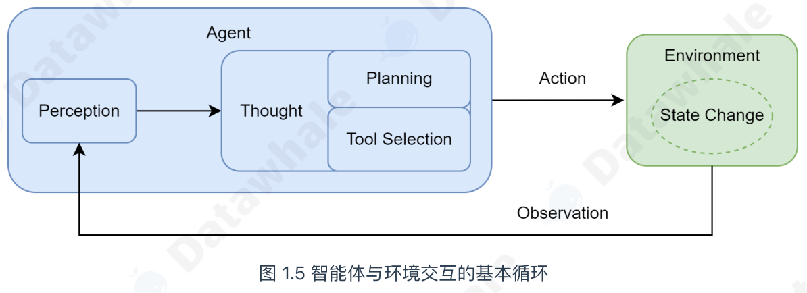

<div align="center">


# Hello-Agents-Code-Explanation

> Hello Agents can be a bit challenging for some beginners. This project explains the code in it and is still being continuously updated. Everyone should check the official sources more often.

**《Hello Agents：从零开始构建智能体》代码逐行精读笔记 —— 给同样在入门路上摸索的你**


**官方教材**：[https://github.com/datawhalechina/hello-agents](https://github.com/datawhalechina/hello-agents)

</div>

---

## 📖 关于本项目

[Hello Agents](https://github.com/datawhalechina/hello-agents) 是 Datawhale 出品的开源智能体构建教程，但对不少初学者来说门槛并不低。

本仓库是我在学习这门课程时整理的**代码讲解笔记**：每一章的示例代码都配有一篇"它是怎么跑起来的"精读文档，尽量做到**零基础也能看懂每一行**。

> ⚠️ **请务必以[官方教材](https://github.com/datawhalechina/hello-agents)为准**。本仓库只是个人学习笔记，讲解如有偏差，欢迎提 Issue / PR 指正。

## 🗺️ 目录结构

```
Hello-Agents-Code-Explanation
├── 第一章/                          # 初识智能体：智能旅行助手（1.3 节动手体验）
│   ├── main.py                     # 程序入口：ReAct 主循环
│   ├── system_prompt.py            # 智能体的系统提示词
│   ├── get_weather.py              # 工具：查询实时天气（wttr.in）
│   ├── get_attraction.py           # 工具：搜索景点推荐（Tavily）
│   ├── requirements.txt
│   ├── .env.example                # 环境变量模板（复制为 .env 使用）
│   └── 智能旅行助手代码逐行讲解.docx  # 📄 第一章讲解文档
├── 第二章/                          # 智能体发展史：规则聊天机器人（2.2 节）
│   ├── main.py                     # ELIZA 风格聊天机器人
│   └── 代码讲解.md                  # 📄 第二章讲解文档
└── assets/                          # README 配图
```

## ✨ 已完成章节

### 01 · 第一章 初识智能体 —— 智能旅行助手（1.3 动手体验）

一个 **ReAct 风格的智能旅行助手**：模型先"思考"（Thought），再决定"行动"（Action）——调用天气或景点工具，程序把工具返回的"观察"（Observation）喂回给模型，循环往复，直到模型给出 `Finish[最终答案]`。



这背后正是智能体的基本运行机制——**智能体与环境的交互循环**：



**核心执行流程**（详见 `main.py`）：

1. `load_llm()` 读取 `.env` 配置，构造 OpenAI 兼容客户端；
2. 把用户请求放进提示历史，调用模型生成一对 `Thought / Action`；
3. `parse_action()` 用正则从输出中解析 Action；
4. 是 `Finish[...]` → 返回最终答案；是 `tool(args)` → 查 `AVAILABLE_TOOLS` 表调用工具；
5. 工具结果以 `Observation: ...` 追加进历史，进入下一轮（最多 5 步）。

📄 **讲解文档**：[第一章/智能旅行助手代码逐行讲解.docx](./第一章/智能旅行助手代码逐行讲解.docx)

### 02 · 第二章 智能体发展史 —— 基于规则的聊天机器人（2.2）

复刻 1966 年 MIT 的经典 **ELIZA"心理治疗师"**：没有神经网络，全靠四步流水线——

```
用户输入 ──▶ 正则匹配句式（re.search）──▶ 捕获组摘出关键词 ──▶ 代词反转（I→you）
        ──▶ 随机套入反问模板 ──▶ "Why do you need help?"
```

它完全不理解语义，却能在几句对话内显得"善解人意"——这正是智能体发展史的第一课。

📄 **讲解文档**：[第二章/代码讲解.md](./第二章/代码讲解.md)
> 💡 文档里还发现了原代码的一个隐藏 Bug：兜底回复的 `return` 缩进在 `for` 循环内，导致除第一条规则外的规则永远不会被尝试。文档给出了定位过程与修复方案。

## 🚀 快速开始

```bash
git clone https://github.com/<你的用户名>/Hello-Agents-Code-Explanation.git
cd Hello-Agents-Code-Explanation
```

**第二章（ELIZA）无需任何 API**，直接运行：

```bash
cd 第二章
python main.py
```

**第一章（旅行助手）需要配置模型与搜索服务：**

```bash
cd 第一章
pip install -r requirements.txt
copy .env.example .env        # macOS/Linux 用 cp .env.example .env
# 编辑 .env，填入下表中的配置
python main.py
```

### 🔑 环境变量说明（写入 `第一章/.env`）

| 变量 | 必填 | 说明 |
|---|:---:|---|
| `LLM_API_KEY` | ✅ | 任意 OpenAI Chat Completions 兼容服务的 API Key |
| `LLM_BASE_URL` | ✅ | 服务地址，如 `https://api.openai.com/v1` |
| `LLM_MODEL_ID` | ✅ | 模型 ID，如 `gpt-4o-mini` |
| `LLM_TIMEOUT` | ⬜ | 请求超时秒数，默认 `60` |
| `TAVILY_API_KEY` | ✅ | [Tavily](https://tavily.com) 搜索密钥（有免费额度），`get_attraction` 工具使用 |

## 🧭 学习路线图

对照官方教材 16 章，跟随学习进度持续更新：

- [x] 第一章 初识智能体 —— 智能旅行助手（1.3 动手体验）
- [x] 第二章 智能体发展史 —— 基于规则的聊天机器人（2.2）
- [ ] 第三章 大语言模型基础
- [ ] 第四章 智能体经典范式构建（ReAct / Plan-and-Solve / Reflection）
- [ ] 第五章 基于低代码平台的智能体搭建（Coze / Dify / FastGPT / n8n）
- [ ] 第六章 框架开发实践（AutoGen / AgentScope / CAMEL / LangGraph）
- [ ] 第七章 构建你的智能体框架
- [ ] 第八章 记忆与检索（记忆系统 / RAG）
- [ ] 第九章 上下文工程（ContextBuilder / 长程智能体）
- [ ] 第十章 智能体通信协议（MCP / A2A / ANP）
- [ ] 第十一章 Agentic-RL（SFT / GRPO 训练）
- [ ] 第十二章 智能体性能评估（BFCL / GAIA）
- [ ] 第十三章 综合项目：智能旅行助手
- [ ] 第十四章 综合项目：自动化深度研究智能体
- [ ] 第十五章 综合项目：构建赛博小镇
- [ ] 第十六章 毕业设计：构建属于你的多智能体应用

## ⚠️ 安全提示

- `第一章/.env` 存有真实 API Key，已被 `.gitignore` 排除，**请勿提交到 GitHub**；
- 提交前可用 `git ls-files` 确认 `.env` 不在版本库中；
- 一旦 Key 泄露，请立即到服务商后台吊销并更换。

## 🤝 参与贡献

发现讲解有误、有更通俗的讲法、或想认领某一章？欢迎 [提 Issue](../../issues) 或直接提交 PR！

## 🙏 致谢

- [Hello-Agents 官方教程](https://github.com/datawhalechina/hello-agents) —— 本仓库所有代码示例与知识体系的来源，学习请认准官方；
- [Datawhale](https://github.com/datawhalechina) —— 开源学习社区的组织者。

---

<div align="center">

**如果这份笔记对你有帮助，欢迎点一个 ⭐ 支持一下！**

</div>
